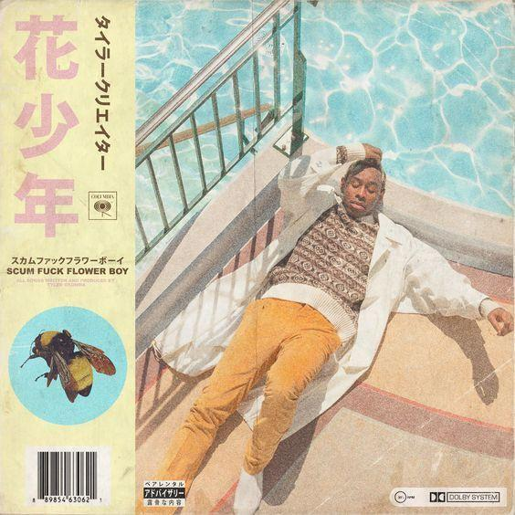
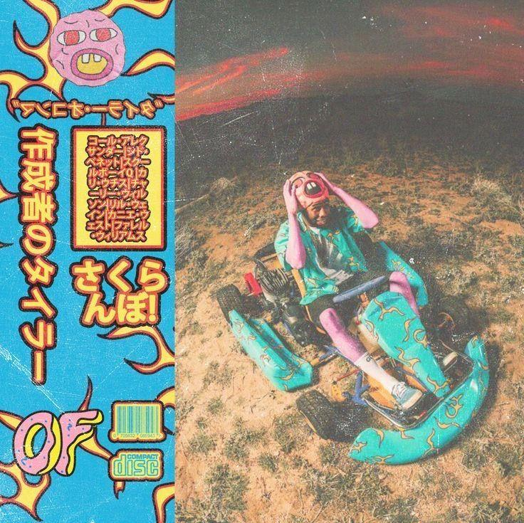

<!-- HEADER SVG ANIMADO -->
<div align="center">


</div>

<div align="center">

</div>

---

<div align="center">

<table>
  <tr>
    <td></td>
    <td></td>
    <td></td>
  </tr>
</table>
</div>

---

<!-- TYPEWRITER -->
<div align="center">


</div>

<!-- LINKS PRINCIPAIS -->
<div align="center">

[](https://luizeh.github.io/selection)
[](https://mail.google.com/mail/?view=cm&fs=1&to=luisricardosoares34@gmail.com)

</div>

<!-- DIVISOR -->


<!-- SOBRE MIM -->
<div align="center">

### `SOBRE MIM`

</div>

```yaml
# ── LUIZEH.config ──────────────────────────────────────
nome: Luís Ricardo Soares
localização: brasil 🇧🇷
aprendendo: PHP e SQL
hobby: Analisar álbuns musicais 🎵
# ───────────────────────────────────────────────────────
```

<!-- DIVISOR -->


<!-- TECNOLOGIAS -->
<div align="center">

# `TECNOLOGIAS`

<h3>— Linguagens Atuais —</h3>

<p align="center">
  
  
  
  
</p>

<br>

<h3>— Ferramentas —</h3>

<p align="center">
  
  
  
  
</p>

<br>

<h3>— Pretendo Aprender —</h3>

<p align="center">
  
  
  
  
  
</p>

</div>

<br>


<!-- Contribuições -->

<div align="center">

# `ESTATÍSTICAS`

<div align="center">

 
<br><br>

<br><br>

</div>
<br><br>


</div>

<!-- FOOTER SVG ANIMADO -->

